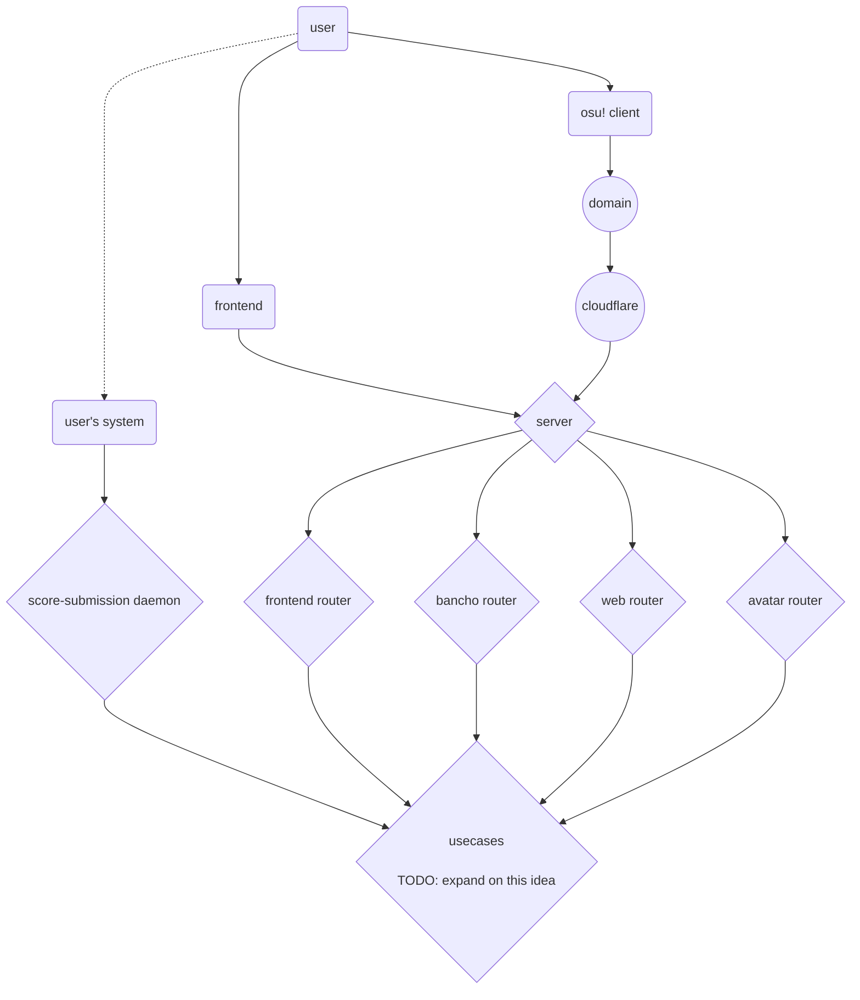

# What happened to LOS?
It was going great for a while along with the frequent updates recieved, right? Well when you don't have any time management skills, it all goes down hill and because it went down hill I just never decided to touch it again.

# Whats going to be new in v2?
New design, new mindset, new me, new everything. The same features from v1 will be included, but the code base and idea of the project will be completely different.

# Design of V2

# Notion Dashboard
If you want to see the specific parts of the project I'm working on or will work on, check out [my notion page on this project!](https://kindhearted-behavior-65b.notion.site/Local-osu-server-edc82b4582e94a6eae641fefdfcfcc4f)